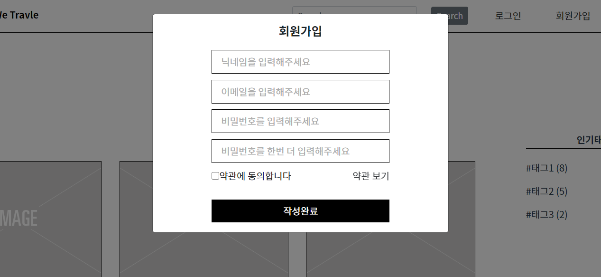
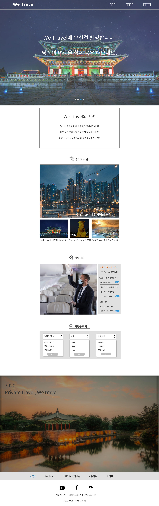
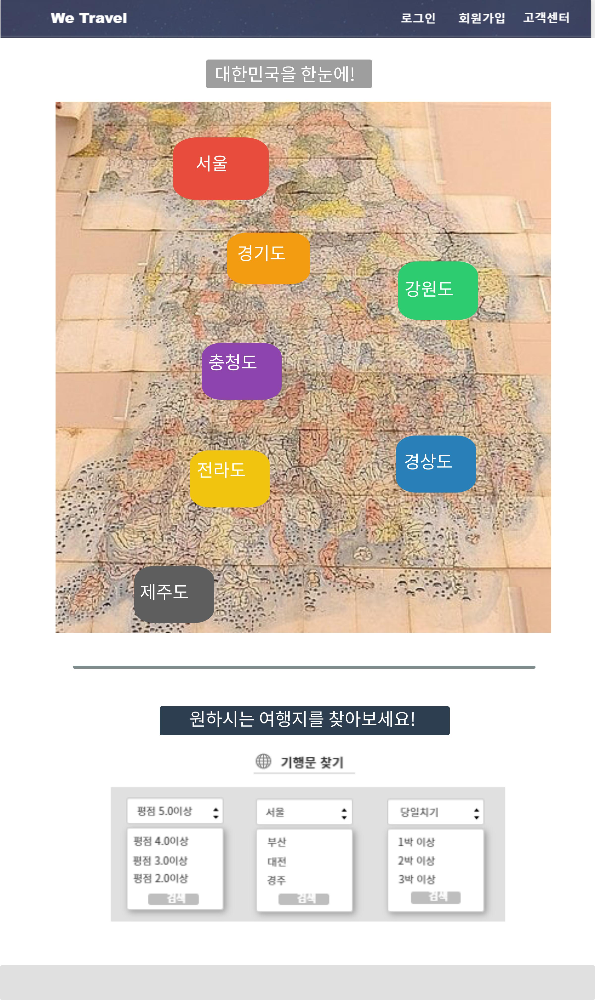
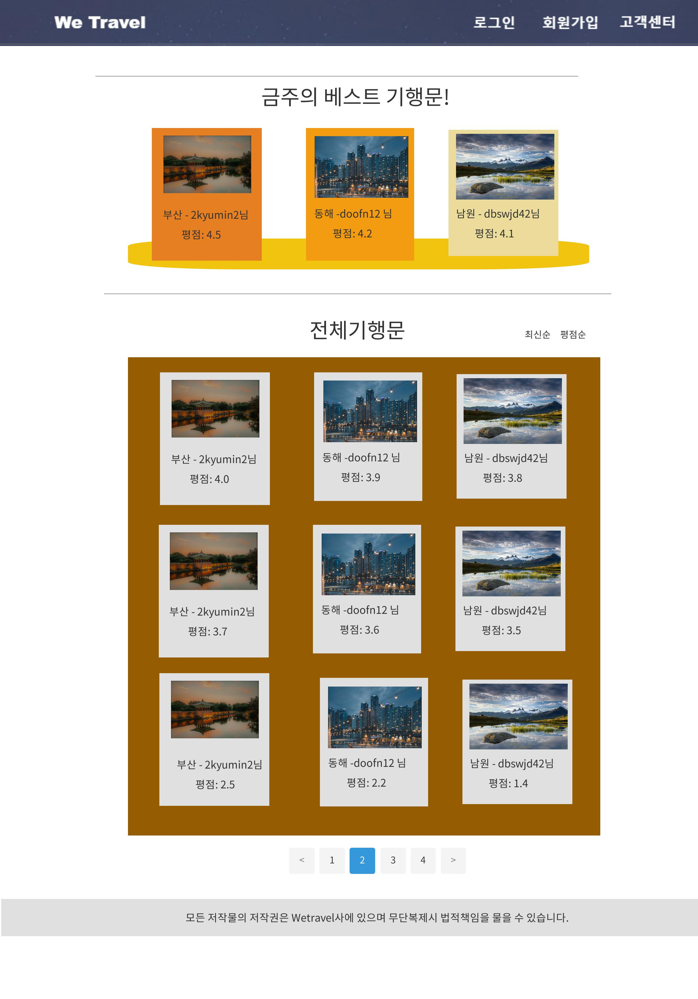
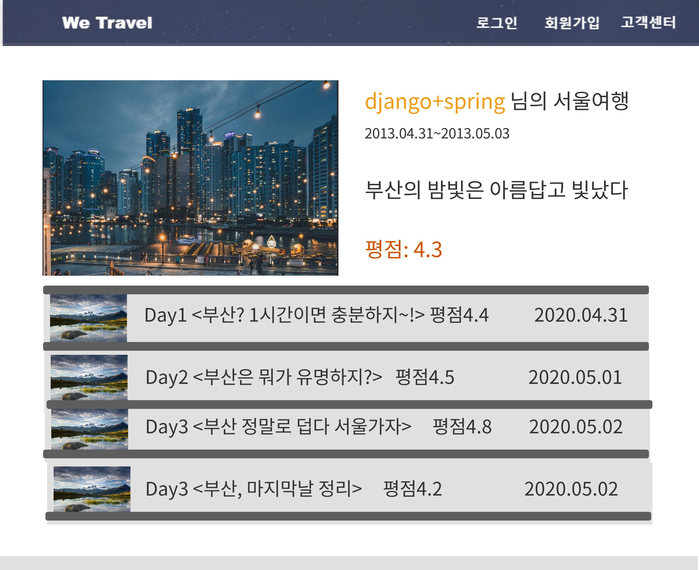
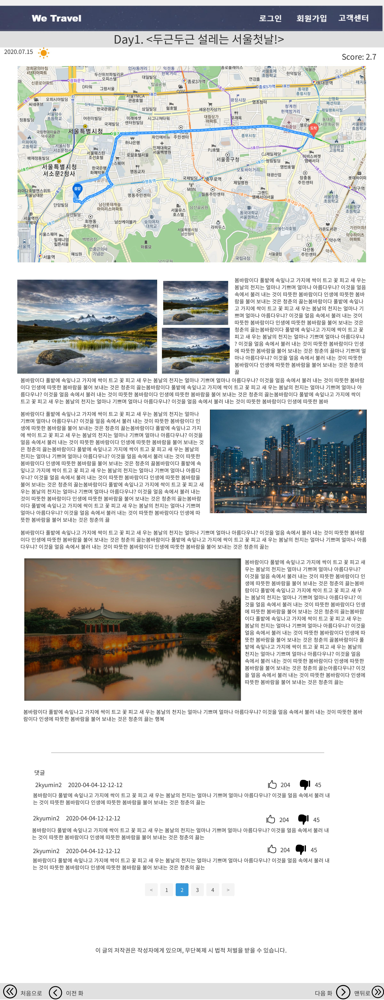
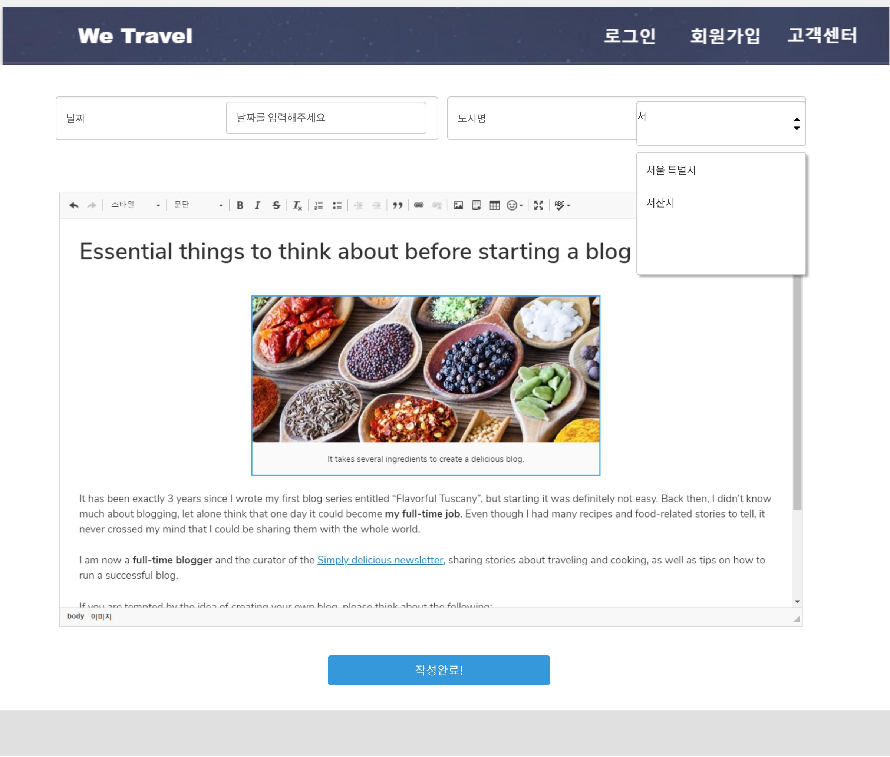
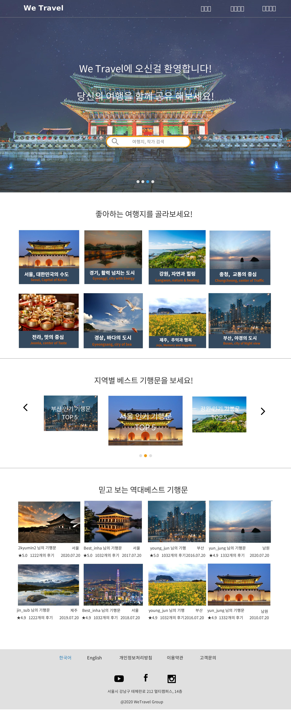

# 07/20

## [팀원]박윤정

1. 팀원들과의 공유 폴더&문서함 만들기
2. article Spring, REST API 개발하기 => DTO작성하다가 디비 설계가 잘못되어 중단
3. 회의 후 도출되는 문제 해결하기

#### Q. 기행문 조회시 도를 보여줄지? 시군을 보여줄지? 

##### A. 도 - 시군 순서/ 도를 누르면 시군을 선택하고, 시군을 선택하면 기행문이 나오도록 => 다각형, 폴리곤라인 활용

##### 카카오맵 API 중 다각형 이벤트 등록하기 2 https://apis.map.kakao.com/web/sample/addPolygonMouseEvent2/

##### 폴리곤 만들기 https://iron-jin.tistory.com/entry/%EC%B9%B4%EC%B9%B4%EC%98%A4-%EC%A7%80%EB%8F%84-api-%EC%8B%9C%EA%B5%B0%EA%B5%AC-%ED%8F%B4%EB%A6%AC%EA%B3%A4-%EB%A7%8C%EB%93%A4%EA%B8%B0-feat-javascript

#### Q. Book을 만들 때 기행문 1개는 꼭 써야하게 해야하는가?

##### A. Book생성시 Article도 1개 생성하도록 구성하자!

#### Q. 원래는 Article만 CRUD를 생각하였는데 그럼 Book도 CRUD기능이 모두 필요한가? 

##### A. Book도 CRUD기능이 모두 필요할 것이라고 생각하자!

4. DB 다시 설계하기 (Book 테이블 추가 및 속성 변경)

#### * CREATE TABLE CODE

CREATE TABLE `user` (
   `email` varchar(50) PRIMARY KEY,
    `password` varchar(20) NOT NULL,
    `nickname` varchar(10) NOT NULL UNIQUE,
    `introduce` varchar(100) NOT NULL
) ENGINE=InnoDB DEFAULT CHARSET=utf8;

CREATE TABLE `book` (
  `bookno` int NOT NULL auto_increment,
  `title` varchar(50) DEFAULT NULL,
  `writer` varchar(50),
  `writedate` datetime DEFAULT current_timestamp(),
  `province` varchar(10),
  `city` varchar(10),
  `startdate` datetime,
  PRIMARY KEY (`bookNo`),
  FOREIGN KEY (writer) REFERENCES user (email)
) ENGINE=InnoDB DEFAULT CHARSET=utf8;

CREATE TABLE `article` (
  `articleno` int NOT NULL auto_increment,
  `bookno` int,
  `title` varchar(50) DEFAULT NULL,
  `writedate` datetime DEFAULT current_timestamp(),
  `score` DECIMAL(3,2),
  `weather` varchar(10),
  `text` mediumtext,
  `traveldate` datetime,
  `day` int,
  PRIMARY KEY (`articleno`),
  FOREIGN KEY (bookno) REFERENCES book (bookno)
) ENGINE=InnoDB DEFAULT CHARSET=utf8;

CREATE TABLE `article_score`(
   `scoreno`  int NOT NULL auto_increment,
    `score` int NOT NULL,
    `author` varchar(50),
    `articleno` int,
    PRIMARY KEY (`scoreno`),
    FOREIGN KEY (author) REFERENCES user (email),
    FOREIGN KEY (articleno) REFERENCES article (articleno)
) ENGINE=InnoDB DEFAULT CHARSET=utf8;

CREATE TABLE `article_comment`(
   `commentno` int NOT NULL AUTO_INCREMENT,
   `articleno` int,
   `writer` varchar(50), 
    `writedate` datetime DEFAULT current_timestamp(),
    `text` varchar(100),
    PRIMARY KEY (`commentno`),
    FOREIGN KEY (writer) REFERENCES user (email),
	FOREIGN KEY (articleno) REFERENCES article (articleno)
) ENGINE=InnoDB DEFAULT CHARSET=utf8;

#### * ER 다이어그램

## [팀장] 윤인하
1. 팀 미팅 및 회의를 통해 개선 방안 및 세부 개선점 정리 - 세부 내용은 위와 같음
2. Swagger 사용

Reference
https://jojoldu.tistory.com/31
http://tech.javacafe.io/spring%20boot/2019/04/21/Spring-swagger/

Code

Swagger 설정 파일

    // swaggerConfig.java
    
    package com.ssafyA205.loginEX.swagger;
    
    import org.springframework.context.annotation.Bean;
    import org.springframework.context.annotation.Configuration;
    import org.springframework.web.servlet.config.annotation.ResourceHandlerRegistry;
    import org.springframework.web.servlet.config.annotation.WebMvcConfigurationSupport;
    
    import springfox.documentation.builders.PathSelectors;
    import springfox.documentation.builders.RequestHandlerSelectors;
    import springfox.documentation.spi.DocumentationType;
    import springfox.documentation.spring.web.plugins.Docket;
    import springfox.documentation.swagger2.annotations.EnableSwagger2;
    
    @Configuration
    @EnableSwagger2
    public class swaggerConfig extends WebMvcConfigurationSupport {
    	@Override
    	public void addResourceHandlers(ResourceHandlerRegistry registry) {
    		registry.addResourceHandler("swagger-ui.html")
    		.addResourceLocations("classpath:/META-INF/resources/swagger-ui.html");
    		
    		registry.addResourceHandler("/webjars/**")
    		.addResourceLocations("classpath:/META-INF/resources/webjars/");
    	}
    	
    	@Bean
    	public Docket api() {
    		return new Docket(DocumentationType.SWAGGER_2)
    				.select()
    				.apis(RequestHandlerSelectors.any())
    				.paths(PathSelectors.any())
    				.build();
    	}
    }

라이브러리 추가

    // pom.xml
    ...
    
    <dependency>
    	<groupId>io.springfox</groupId>
    	<artifactId>springfox-swagger2</artifactId>
    	<version>2.9.2</version>
    </dependency>
    
    <dependency>
    	<groupId>io.springfox</groupId>
    	<artifactId>springfox-swagger-ui</artifactId>
    	<version>2.9.2</version>
    </dependency>
    
    ...

실행 화면 (localhost/swagger-ui.html)

## [팀원] 임진섭

### 이미지의 메타데이터를 활용하여 위치데이터를 카카오맵과 연동하여 띄우기

#### To do
- 하나의 지도에 클러스터링으로 나타내기
- 위치 데이터가 없을 경우의 처리 방안

## [팀원] 강용준

### Front - 로그인 창 구상

## [팀원] 이규민

### 와이어 프레임워크 구상

main 페이지

# 07/21

## [팀원] 강용준

### 메인페이지 구현

메인페이지 사진 Carousel로 구현 ( 자동 슬라이드 )

글자 애니메이션 삽입

로그인 / 회원가입 코드 수정

## [팀원] 이규민

### 기행문 목록 와이어프레임워크 완성

![[책장2] Untitled](README.assets/[책장2] Untitled.jpg)

- booking.com 사이트 참고
- 기행문 추천기능

## [팀원] 박윤정

### Backend를 위한 Spring Boot 프로젝트 생성, 깃랩에 커밋 

- STS와 Git연동에 문제 발생 => 문제 해결을 위해 JGit이 아닌 GitBash를 이용!
- 틀만 생성 => 생성해둔 틀에 맞춰 파일 생성시 이름 양식 맞추면 좋을 듯!
- Article에 대한 dto 코드 약간 작성!

## [팀장] 윤인하

### Vue.js + Spring 연동 테스트

- Frontend와 Backend를 통합하여 하나의 서버로 연동해 보았으나 빌드나 페이지를 읽는 데 문제 발생
- Skeleton Project처럼 Frontend와 Backend 각각 다른 서버에서 실행 후 Axios로 연동 테스트 예정 

## [팀원] 임진섭

### geojson을 이용한 맵 폴리곤 개발중

- 행정구역 정보를 geoJosn으로 변경하여 폴리곤 형태로 맵으로 띄워 이벤트 효과를 구현할 예정
- geoJson에서 값을 받아오는 부분에 문제가 발생하여 문제 해결중

# 07/22

## [팀원] 이규민

- Front - main 페이지 디자인/구성 수정
- 와이어프레임 수정
- 

## [팀원] 강용준

- 메인페이지 구현

- 메인페이지 디자인 변경으로 인한 수정 진행

## [팀원] 박윤정
- Article관련 Rest API 관련 개발 진행중 => Book이 우선적으로 필요하여 아직 완성 못함
- 에디터 활용해보기, 실제 데이터 어떤식인지 살펴보기
1. CKEditor 4 Vue 사용코드 
https://ckeditor.com/docs/ckeditor4/latest/guide/dev_vue.html#editor-instance

2. CKEditor 4 CDN으로 간단 테스트
https://cdn.ckeditor.com/

## [팀장] 윤인하

- Frontend에서 Axios로 REST API 사용하여 Backend와 통신
- Frontend에서는 FormData로 보낼 데이터를 묶은 후 application/json 형식으로 전송

- Backend에서는 @RequestBody를 이용해 json 데이터를 VO에 매칭시켜줘야 함

## [팀원] 임진섭
- 카카오맵에 폴리곤 기능 추가하여 클릭하면 해당지역으로 확대되는 이벤트 적용

# 07/23

## [팀원] 박윤정
- Article에 대한 Spring REST API 설계 및 개발

- 개발 중 직면한 문제 해결

#### Q. Book1개 만들때 Article1개 무조건 생성할 것인가?

##### A. NO, 개별적으로 생각하는 거이 편할 듯!

#### Q. Book에 관련된 검색 옵션 무엇이 필요한가 ????

##### A. 일단 조회순, 평점순만 생각하고 진행하자!!

#### Q. Article에 관련된 검색 옵션 무엇이 필요한가 ????

##### A. Article에 대한 검색 옵션은 없는 걸로 생각하자!!

#### Q. 특정 데이터 리스트 전달 시 정렬해야 하는 데이터를 정렬하는 것은 backend에서, frontend에서 ????

##### A. backend에서 미리 정리된 채로 주는 것이 frontend입장에서 편할 것 같다.

- Book에 대한 Spring REST API 설계 및 개발을 위한 파일 생성

## [팀원] 강용준

- 사용자들이 쉽게 접근 할 수 있도록 기존의 메인페이지에서 더 간결하게 정보를 전달 (기존 웹사이트들의 형태를 모방)
- keyframe과 vue-carousel 3d opensource를 활용하여 동적인 애니메이션 효과를 유저에게 전달
- 목적에 맞는 브랜드 컬러 설정 

## [팀원] 이규민

![[수정본 모음집] 인기기행문 탑5 (3)](README.assets/[수정본 모음집] 인기기행문 탑5 (3)-1595494574994.jpg)

### 1. 와이어프레임워크 전부 수정

- 전체적인 색감 통일하기 -> 남색

- Top5페이지 누르면 top5만 나오도록수정
- 검색옵션 모든페이지 `옵션검색`으로 수정!
- Book 생성, Article 생성 나눠야함

### 2. 지역별 대표 사진 선별

## [팀장] 윤인하

- Gitlab 내 공유 프로젝트로 기능 옮기기
- 연동 부분에서 CORS 문제 다시 발생 -> proxy 이용하여 연동
- 내일 AWS로 server 올려서 정상 동작하는지 테스트 예정

## [팀원] 임진섭

- branch 관리하기

현재 우리의 branch 구조

             master
       	   ㅣ
             develop
             |    |
          front    back
             |        |  => 각자 branch 추가할 부분

##### 0.내 로컬의 브랜치 확인하기
git branch : 현재 로컬에 있는 브랜치 확인하는 명령어

##### 1.remote의 브랜치 가져오기
git remote update : 원격 브랜치에 접근하기 위해 갱신하는 명령

##### 2.내 로컬에 없는 branch가 있다면 아래의 명령어로 내 로컬에 브랜치 추가

ex) git checkout -t origin/develop
     git checkout -t origin/front
     git checkout -t origin/back
     ...

##### 3.내 로컬에 모든 branch 추가 되었으면 각자 자신의 포지션으로 이동(백엔드는 back, 프론트는 front)
ex) git checkout back
     git checkout front

##### 4.자신의 포지션에서 알맞은 이름의 branch를 생성
ex) git branch article

##### 5.4번에서 만든 branch에서 add와 commit을 실시

##### 6.상위 branch로 이동하여(front, back) merge를 실시
ex) git merge --no-ff article

##### 7.그 다음 상위 branch인 develop으로 이동하여 merge 실시
ex) git merge --no-ff front or back(자신의 포지션)

##### 8.develop branch를 remote에 push 하고 싶다면 명령어 실시
ex) git push origin develop

Branch를 바꾸면 해당 branch에서 push한 내용만 확인 가능!!
디폴트 master일텐데 master로 되어 있으면 develop에서 push한 내용이 보이지 않는 듯!!

##### 9. 가장 상위 branch인 master에 push하고 싶다면 master로 이동 후 merge -> push 실시
ex) git checkout master
ex) git merge --no-ff develop
ex) git push origin master

Branch를 바꾸면 해당 branch에서 push한 내용만 확인 가능!!

##### 참고사이트
- https://mylko72.gitbooks.io/git/content/branch/branch_type.html
- https://blog.outsider.ne.kr/572
- https://trustyoo86.github.io/git/2017/11/28/git-remote-branch-create.html
- https://trustyoo86.github.io/git/2017/11/28/git-remote-branch-create.html

# 07/24

## [팀장]윤인하
##### 1. AWS에 Backend Server 올리고 동작 확인
- jar 파일로 build하여 내장 tomcat으로 실행, local의 frontend와 REST API 연동 확인
- SpringBoot는 jsp를 지원하지 않아 webapp 내의 페이지는 404 error 발생, war로 바꾸면 jsp 사용 가능하다고 함
- 현재는 내장 tomcat을 쓰고 있는데 이를 docker image로 만들어서 docker에서 배포하는 것도 생각 중

## [팀원] 박윤정
- Book에 대한 Spring REST API 설계 및 개발
- 

## [팀원] 임진섭

- 카카오맵 기능 재정의 및 활용도 재구성

지역별 여행문 조회를 위한 기능으로

# 07/27

## [팀원] 박윤정
- Book에 대한 Spring REST API 설계 및 개발

###### 검색방식 변경 => 옵션(대분류, 소분류, 월) [ 가능한 경우 : default+default, 대분류+default, 대분류+소분류 / month(필수x) ]
###### 역대베스트 기행문 => 평점순으로
###### Book에 대한 정보 불러올 때 최신순(default) / 평점순 API 추가
###### 특정 User에 대한 Book정보 => 최신순으로

- User에 대한 Spring REST API 설계 및 개발 시작

## [팀장] 윤인하
- Vue-router, Vuex 공부 및 프론트 내 로그인 정보 저장 구현 중
- 출처: https://lovemewithoutall.github.io/it/vue-login-demo/

## [팀원] 강용준

- vue-router, vuex 공부
- 동적인 화면 구현을 위해 JavaScript 공부
- 메인페이지 틀 코딩완료 후 다른 페이지 작업 시작